# 🎓 Projet Laravel – Gestion des Formations et Candidats

## 📚 Contexte

Ce projet a été réalisé en **2023** dans le cadre d’un **projet académique Laravel**, avec pour objectif principal de **renforcer la maîtrise d’Eloquent ORM** et des **requêtes complexes** sur une base de données relationnelle.

L’application permet de gérer des **formations**, des **référentiels**, des **types de domaines**, ainsi que les **candidats inscrits**, avec plusieurs statistiques représentées sous forme de **graphes**.

---

## 🧩 Entités principales

### 🔹 TYPE

Représente la **catégorie générale** d’une formation.

Exemples :

* Informatique
* Gestion
* Santé

---

### 🔹 REFERENTIEL

Sous-ensemble d’un **Type**.

Exemples :

* Développement Web
* Réseaux Informatiques
* Gestion de projet
* Comptabilité

---

### 🔹 FORMATION

Niveau le plus concret.

Elle répond à la question : **quelle formation exactement ?**

Exemples :

* Formation PHP
* Formation JavaScript
* Administration Réseau
* Comptabilité Générale

---

### 🔹 CANDIDAT

Représente une personne inscrite à une formation.

Champs principaux :

* Nom
* Prénom
* Email
* Sexe
* Âge
* Niveau d’étude
* Formation (clé étrangère : `id_formation`)

---

## ⚙️ Fonctionnalités

* ➕ Ajout de Type
* ➕ Ajout de Référentiel
* ➕ Ajout de Formation
* ➕ Ajout de Candidat
* 📌 Inscription d’un candidat à une formation

### 📊 Statistiques & Requêtes avancées

* Nombre de candidats par formation
* Nombre de formations par référentiel
* Nombre de candidats par sexe (toutes formations confondues)
* Statistiques par tranche d’âge (toutes formations confondues)
* Statistiques des formations **en cours** et **en attente**

📈 Toutes les statistiques sont **représentées sous forme de graphes**.

---

## 🛠️ Technologies utilisées

* **Laravel**
* **PHP**
* **MySQL**
* **Eloquent ORM**
* **HTML5**
* **CSS3**
* **JavaScript**
* **Bootstrap**
* **Chart.js / Librairie de graphiques**

---

## 🖼️ Captures d’écran

Les captures d’écran du projet se trouvent dans le dossier suivant :

```
/screenshots
```

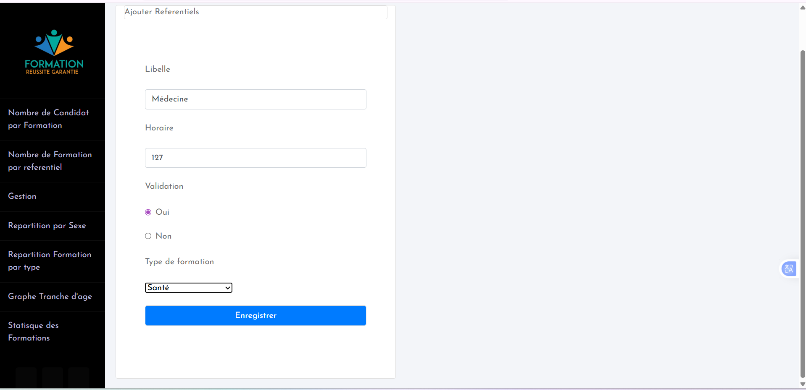
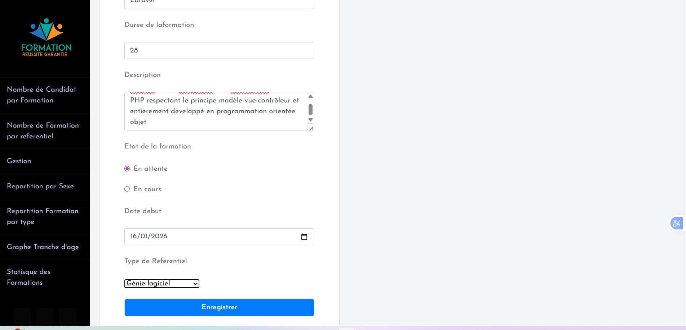

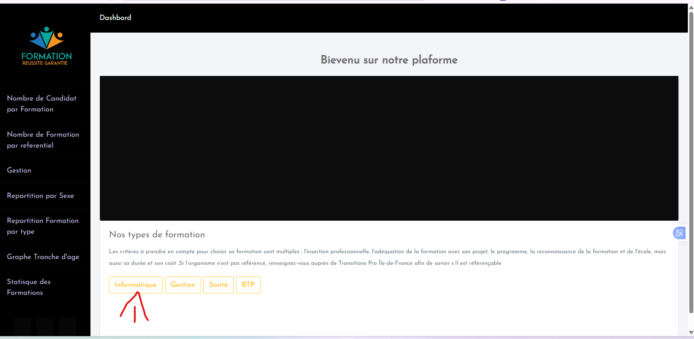
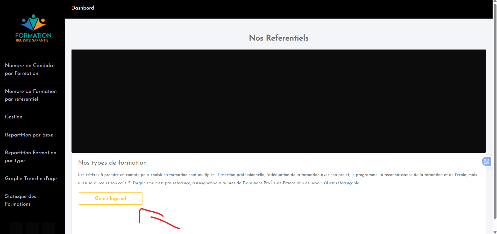
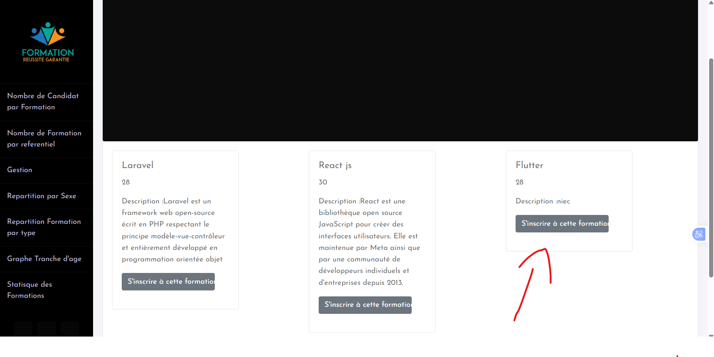
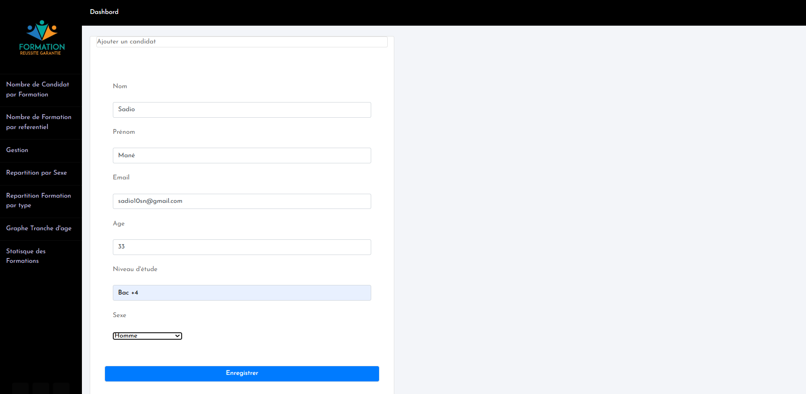

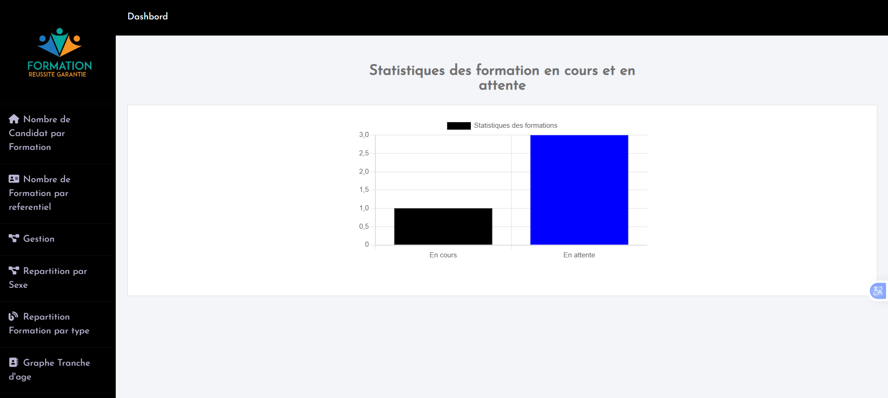
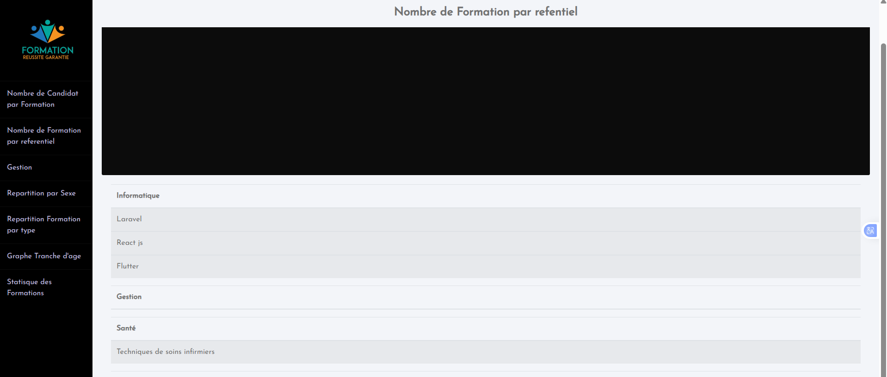
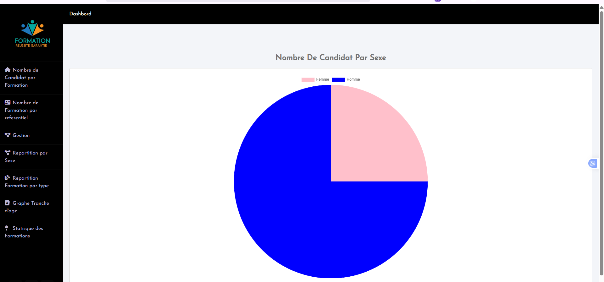

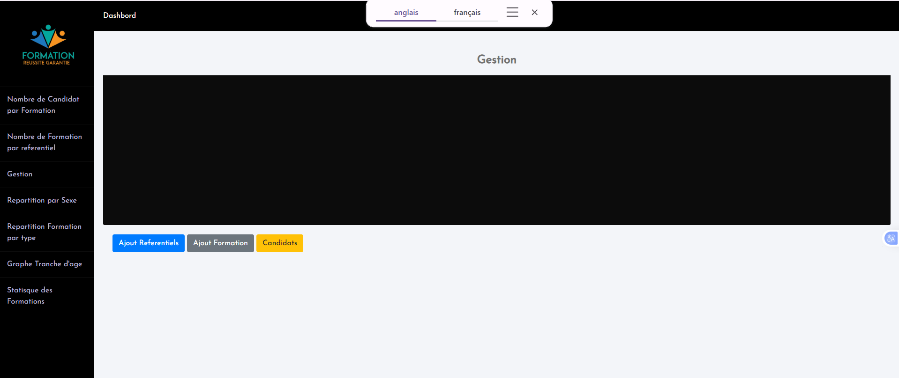
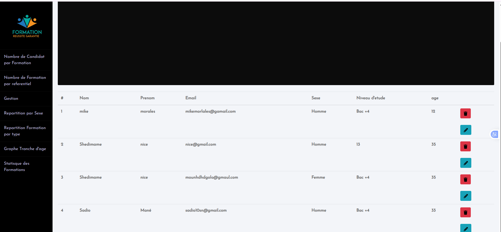

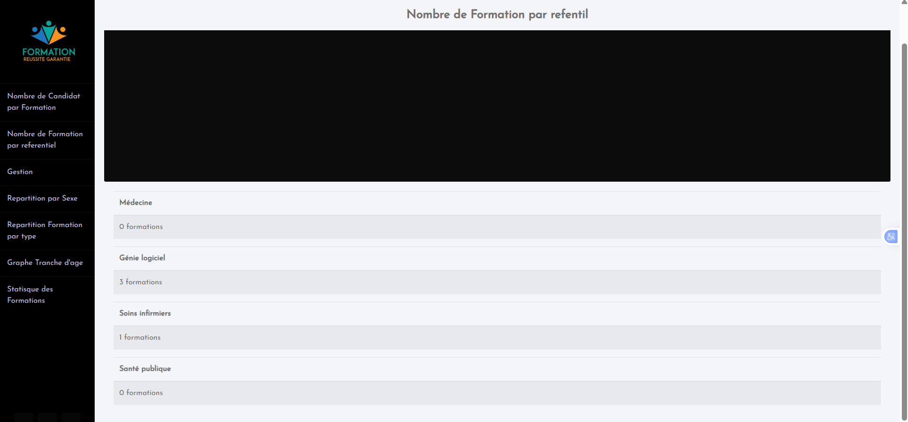
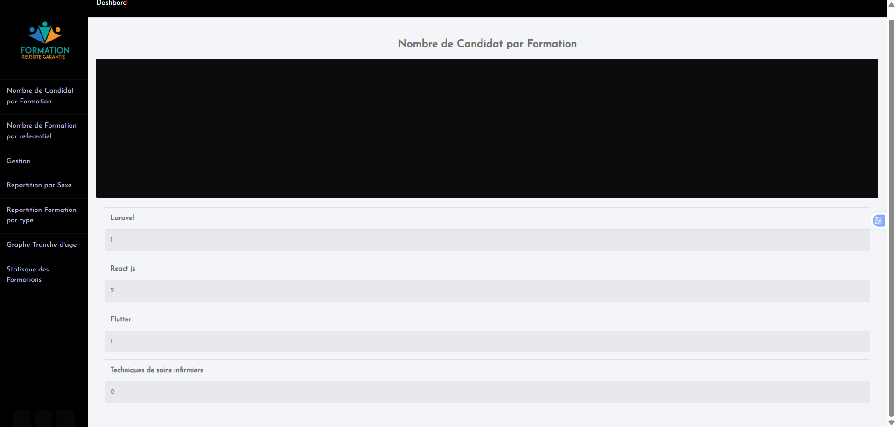


Aperçu :

* 01 / 02 : Structure générale et navigation
* 1 → 4 : Gestion des Types et Référentiels
* 5 → 7 : Gestion des Formations
* 8 → 9 : Gestion des Candidats
* 10 → 11 : Statistiques et graphiques

---

## 🚀 Installation et lancement

1. Cloner le projet

```bash
git clone <url-du-projet>
```

2. Installer les dépendances

```bash
composer install
npm install && npm run dev
```

3. Créer le fichier d’environnement

```bash
cp .env.example .env
```

4. Générer la clé de l’application

```bash
php artisan key:generate
```

5. Configurer la base de données MySQL dans `.env`

6. Lancer les migrations

```bash
php artisan migrate
```

7. Démarrer le serveur

```bash
php artisan serve
```

---

## 📌 Apports du projet

Ce projet m’a permis de :

* Mieux comprendre les **relations Eloquent** (OneToMany, ManyToOne)
* Écrire des **requêtes complexes** avec Eloquent
* Exploiter les données pour produire des **statistiques pertinentes**
* Structurer un projet Laravel de manière propre

---

## 👨‍🎓 Auteur

Projet réalisé par **Glenn Leonard**
Projet académique – Laravel & MySQL
Année : **2023**

---

✅ Projet pédagogique axé sur la pratique avancée d’Eloquent ORM.
 